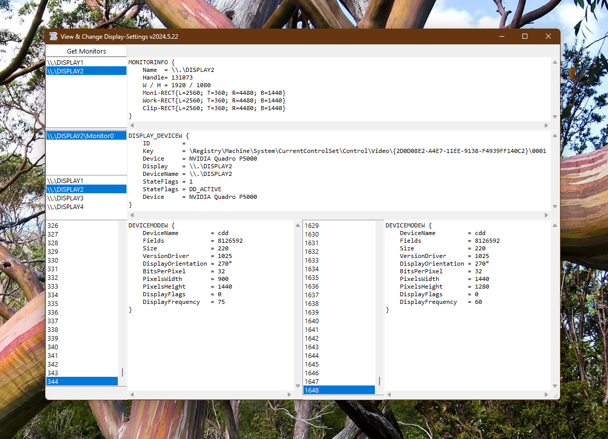

# Sys_DisplayMonitor  
## View and Change Display and Monitor Settings    

 

Project started in may 2024.  
This example shows how to read and write display settings. 
It contains the classes Monitor, DisplayDevice and DeviceMode. It may replace the VB.Screen object.  
It works with Unicode in VB6-x86 as well as in VBA, VBA7-86 & VBA7-x64.  

